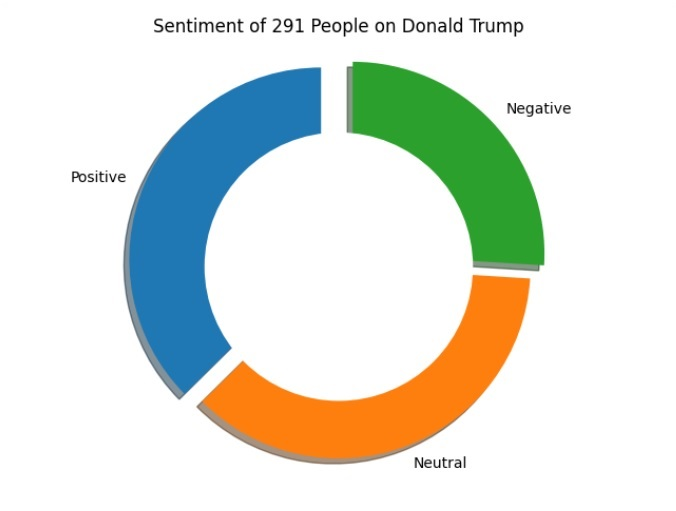

# Sentiment Analysis - Made with 💗 by Amritansh-Ashesh

Sentiment analysis is the interpretation and classification of emotions (positive, negative and neutral) within text data using text analysis techniques. Sentiment analysis tools allow businesses to identify customer sentiment toward products, brands or services in online feedback.However, analysis of social media streams is usually restricted to just basic sentiment analysis and count based metrics.

Basic sentiment analysis of text documents follows a straightforward process:

-Break each text document down into its component parts (sentences, phrases, tokens and parts of speech)
-Identify each sentiment-bearing phrase and component
-Assign a sentiment score to each phrase and component (-1 to +1)

>Terrible pitching and awful hitting led to another crushing loss.

>Bad pitching and mediocre hitting cost us another close game.

Both sentences discuss a similar subject, the loss of a baseball game. But you, the human reading them, can clearly see that first sentence’s tone is much more negative.

Your brain figures this out by looking for and interpreting sentiment-bearing phrases – that is, words and phrases that carry a tone or opinion. These usually appear as adjective-noun combinations. In the examples above, the sentiment-bearing phrases are:

>Terrible pitching | awful hitting | crushing loss

>Bad pitching | mediocre hitting | close game

You have encountered words like these many thousands of times over your lifetime across a range of contexts. And from these experiences, you’ve learned to understand the strength of each adjective, receiving input and feedback along the way from teachers and peers.

When you read the sentences above, your brain draws on your accumulated knowledge to identify each sentiment-bearing phrase and interpret their negativity or positivity. Usually this happens subconsciously. For example, you instinctively know that a game that ends in a “crushing loss” has a higher score differential than the “close game”, because you understand that “crushing” is a stronger adjective than “close”.

So, why are we using baseball games to explain how human brains do sentiment analysis? The answer is simple: **computer sentiment analysis works (almost) the same way.**

The Output would be in the following format:
'''
Relevant Reddit posts: 241
Relevant Tweets: 71
Positive tweets percentage: 32.051 %
Negative tweets percentage: 24.679 %
Neutral tweets percentage: 31.731 %

*10 Positive Posts
10 Negative Posts
10 Neutral Posts*
'''
A beautiful Pie Chart visualizing the result

Source for Readme: https://www.lexalytics.com/technology/sentiment-analysis
